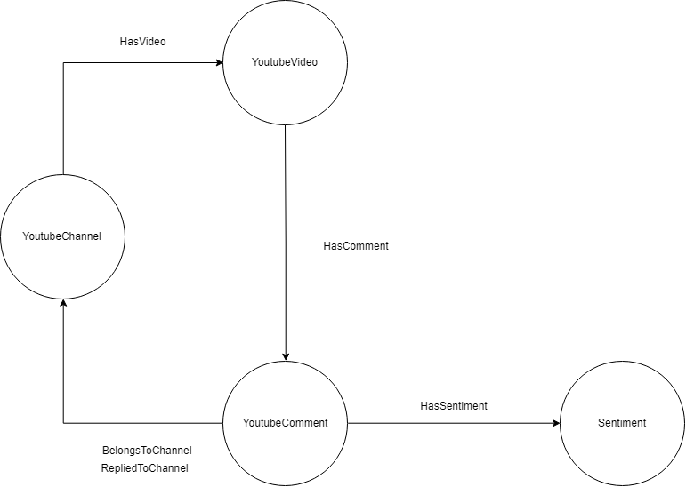

# yt-news-exploration
The main purpose of this project is to develop a scalable architecture for extracting information from YouTube and building some machine learning models over the data. The things I will be extracting are news videos. The concept is as follows:
1. Query YouTube API for news channels.
2. For every channel, scrape videos information based on some criteria (chronologically, either ascending or descending).
3. For every video, scrape commentThreads information (root-level comments).

### Some ideas for ML models over that kind of data:
1. By doing semantic analysis over the comments, answer whether the poarticular news is positive or negative.
2. Compare same news representation over different channels.
3. Search for general attitude of speciffic user based on all of their comments.

## Architecture
1. Docker container with OrientDb for the graph store.
2. Docker container with NodeJS for the scraping.
3. Docker container with Python for the classification of data.
4. Docker container with JupyterNotebook for data exploration.

### Technologies
1. NodeJS
2. Db - OrientDb (mostly using the graph store)
3. OrientJS - OrientDB driver for NodeJS

### Queries
I have made some abstractions over the google rest api. The following function is used to query the api using api key.

```javascript
function gapiRequest(api, params);
```

Retrieve list of news channels
```javascript
await gapiRequest('youtube/v3/search', {
    part: 'snippet',
    maxResults: 5,
    q: searchTerm,
    type: 'channel'
  });
```

Retrieve list of videos that belong to `channelId`
```javascript
await gapiRequest('youtube/v3/search', {
    part: 'snippet',
    channelId: channelId,
    maxResults: 5,
    type: 'videos'
  });
```

Retrieve list of comments that belong to `videoId`
```javascript
await gapiRequest('youtube/v3/commentThreads', {
    part: 'snippet',
    videoId: videoId,
    maxResults: 5
  });
```

#### Architecture diagram


## Distributed OrientDB
Orientdb uses master-less scheme for distributed architecture. That means every node is master. There is option to create node only for replication, but thats more advanced use-case. Distribution is based on Hazelcast project which provides auto-discovery of nodes and synchonization of configurations. There are 3 main files that take part in the configuration of distributed nodes:
  1. orientdb-server-config.xml - used to define basic information for the node and to enable speciffic plugins
  2. default-distributed-db-config.json - used to set parameters like auto deploy and default configurations for new nodes in the cluster
  3. hazelcast.xml - used to define auto-discovery protocols and network topology

Note that the default configurations work perfectly for local testing with docker. I created local bridge network called `big-data-network` in which ports between containers are opened. After that run containers in that network and give them different port mappings and names. Command for runnig odb container:
```Bash
docker run -d \ 
--name <container-name> \ 
--network big-data-network \ 
-p <host-port-binary>:2424 \ 
-p <host-port-odb-studio>:2480 \ 
-e ORIENTDB_ROOT_PASSWORD=<some-password> \ 
-e ORIENTDB_NODE_NAME=<container-name> \ 
orientdb /orientdb/bin/server.sh -Ddistributed=true
```

If you want to map volumes from host to container filesystem you can use the -v parameter like this
```Bash
-v "<host-full-path>/config":"/orientdb/config"
```

#### Results after running 4 containers with the above command:


After this, to copy-paste backup of database to one of the servers in the cluster using 
```BASH
docker cp "C:\\BACKUP\orientdb\youtube-db" odb1:"orientdb\databases"
``` 
Distributation software will then replicate the database to every node in the cluster which results in the following table.


### Topology of the graph


Example query for collecting the statistics of videos
```javascript
MATCH 
{Class: YoutubeVideo, as: video}
-HasComment-
{Class: YoutubeComment, as: comment}
-HasSentiment-
{Class: VaderSentiment, as: sentiment}
return video.@rid as videoRid, video.tag as tag, comment.textOriginal as text, comment.likeCount as likes, sentiment.compound as sentiment
```

### Graph distribution
Each class is spanned across multiple clusters which can be on different servers. 


### Partitioning vs Sharding
<b>`Partitioning`</b> is refered as `vertical scaling` which means that different attributes from one object can be stored at different places. On the other hand, <b>`Sharding`</b> means that the whole object is stored at one place, but there are multiple places where we can store objects. This is refered as `horizontal scaling`. Orientdb supports sharding of classes, because each class can span accross multiple clusters possibly on different servers. There is configuration file that maps clusters to servers.
4. sharding of data, replicating some clusters only on part of the nodes (servers)


Orientdb uses Apache Spark (Pregel) for querying `sharded` classes. In short, the process of traversing the graph is split in `iterations` which consists of computing the state of objects called `triplets = 2 vertices connected by edge`. Triplets are `mapped` to resulting objects and then `reduced` combining the results from the different nodes, and this is repeated for every next step of traversion. There are some algorithms for `vertex-splitting` which can help one to model the sharding of data, maximazing its `locality`. 

[The paper can be found here](https://stanford.edu/~rezab/classes/cme323/S15/notes/lec8.pdf)

##### Whats next?
1. `docker-compose` of all the nodes
2. `kubernetes` vs `docker swarm` orchestration in order to deploy to the cloud
3. custom `hazelcast.xml` configuration for each cloud provider